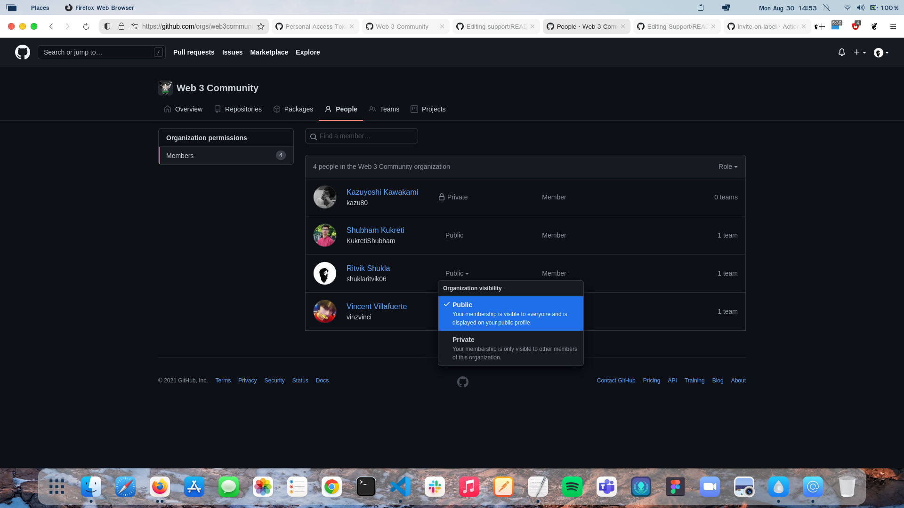

<h1 align="center"> Welcome to Web 3 Community Support</h1>

### How to join the community?

- Raise an <code> [issue](https://github.com/web3community/support/issues/new?assignees=&labels=github-invitation&template=invitation.yml&title=Please+invite+me+to+the+community)</code> to join the Web 3 community.

> Since we are new community, we are looking forward to more collaboration, share ideas and many more. We will create Open Source Projects that focus on Web 3 & Blockchain technologies.

### Why you should join this community?

- We believe that the interaction with people is very important for anyone's personal growth, Here You will get to interact with some great folks 
- You can learn together
- This community is in its initial stage so you can show your leadership skills also
- The community is diverse and inclusive

We believe that there is a learning opportunity for everyone in every question! So don't be shamed to ask your question :)

**How do I set the Organization to Public?** 

You can make the organization public by:  

- Navigate to our community page: https://github.com/web3community
  
- Click on people:
	
	

- Enter your username or name in the searchbar:
	
	
  
- Click `Private` (the default) and set it to `Public`:
	
	

  
## About

Best Resources to Learn Blockchain Technologies 
- https://www.notion.so/Getting-Started-with-Blockchain-and-Ethereum-92ba0d551e2f46a2adeed5d0e83fb3d0
- https://dev.to/dabit3/the-new-creator-economy-daos-community-ownership-and-cryptoeconomics-lnl
- https://academy.binance.com/en
- https://www.postman.com/blockchainnow/workspace/tatum-io/overview

Getting Started with Dev Protocol
- https://docs.devprotocol.xyz/en/

### Don't Forget to join our discord 💜

 

